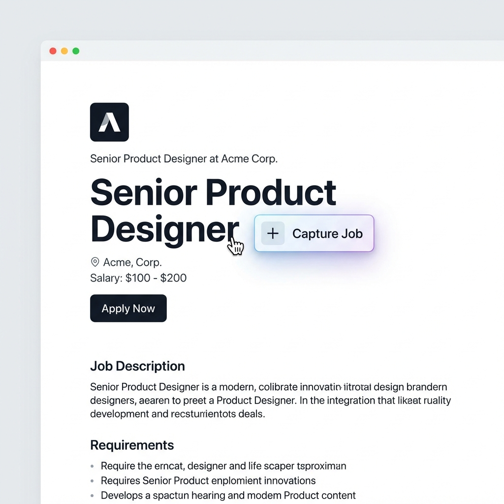

# 🚀 JobFlow - Job Application Tracker Chrome Extension

<div align="center">
  
  
  **Save job postings from LinkedIn and career sites directly to Google Sheets with one click!**
  
  [](https://github.com/MozartofCode/Job-Application-Tracker)
  [](https://developer.chrome.com/docs/extensions/mv3/)
  [](LICENSE)
</div>

---

## ✨ Features

- **🎯 One-Click Capture**: Beautiful "Capture Job" button appears on job postings
- **📊 Auto-Save to Google Sheets**: Jobs automatically sync to your spreadsheet
- **💾 Smart Tracking**: Once saved, jobs stay marked as "Saved" - no duplicate entries!
- **🔄 Offline Queue**: Jobs saved locally and synced when online
- **💼 LinkedIn Support**: Optimized scraping for LinkedIn job pages
- **🌐 Universal Scraper**: Works on most company career sites
- **🔐 Secure OAuth2**: Uses Google's official authentication
- **📱 Modern UI**: Sleek popup with live stats and status

---

## 🎬 Quick Start

### Prerequisites

1. **Google Account** with access to Google Sheets
2. **Google Cloud Project** with OAuth2 configured (see setup below)
3. **Chrome Browser** (or Chromium-based browser)

### Installation

1. **Clone the repository**
   ```bash
   git clone https://github.com/MozartofCode/Job-Application-Tracker.git
   cd Job-Application-Tracker
   ```

2. **Configure OAuth2 Client ID**
   
   Open `manifest.json` and replace the placeholder:
   ```json
   "oauth2": {
     "client_id": "YOUR_OAUTH_CLIENT_ID.apps.googleusercontent.com",
     ...
   }
   ```

3. **Load the extension**
   - Open Chrome and go to `chrome://extensions/`
   - Enable **Developer mode** (toggle in top right)
   - Click **Load unpacked**
   - Select the `Job-Application-Tracker` folder

4. **Authenticate**
   - Click the JobFlow extension icon
   - Click **Connect Google Account**
   - Grant permissions to access Google Sheets

---

## ⚙️ Google Cloud Setup (OAuth2)

### Step 1: Create a Google Cloud Project

1. Go to [Google Cloud Console](https://console.cloud.google.com)
2. Click **Select a project** → **New Project**
3. Name it: `JobFlow Extension`
4. Click **Create**

### Step 2: Enable Google Sheets API

1. In the sidebar, go to **APIs & Services** → **Library**
2. Search for **Google Sheets API**
3. Click **Enable**

### Step 3: Configure OAuth Consent Screen

1. Go to **APIs & Services** → **OAuth consent screen**
2. Select **External** user type
3. Fill in required fields:
   - **App name**: JobFlow
   - **User support email**: Your email
   - **Developer contact**: Your email
4. Click **Save and Continue**
5. On **Scopes**, click **Add or Remove Scopes**
6. Add: `https://www.googleapis.com/auth/spreadsheets`
7. Click **Save and Continue**
8. On **Test users**, add your Gmail address
9. Click **Save and Continue**

### Step 4: Create OAuth2 Credentials

1. Go to **APIs & Services** → **Credentials**
2. Click **Create Credentials** → **OAuth client ID**
3. Application type: **Chrome extension**
4. Name: `JobFlow Extension`
5. **Extension ID**: 
   - Load your extension in Chrome (step 3 above)
   - Copy the extension ID from `chrome://extensions/`
   - Paste it here
6. Click **Create**
7. **Copy the Client ID** and paste it in `manifest.json`

### Step 5: Prepare Your Google Sheet

1. Create a new [Google Sheet](https://sheets.google.com)
2. Add headers in row 1:
   ```
   Company name | Position | Location | Link | Salary
   ```
3. Copy the **Spreadsheet ID** from the URL:
   ```
   https://docs.google.com/spreadsheets/d/1pZRhmdjj8g3e9BKjtxiHTrEEqyl9goGfagGdxWRLpAE/edit
                                          ↑ This is your Spreadsheet ID ↑
   ```
4. The ID is already configured in `background.js` - update it if using a different sheet!

---

## 🎨 How It Works

### LinkedIn
When you visit a LinkedIn job posting, JobFlow injects a beautiful **"Capture Job"** button next to the job title:



### Career Sites
On company career pages, a **floating action button** appears in the bottom-right corner.

### Data Flow
1. 🖱️ **Click** "Capture Job" button
2. 🔍 **Scrape** job details (title, company, location, etc.)
3. 💾 **Save** to local queue (offline support)
4. ⚡ **Sync** to Google Sheets via API
5. ✅ **Confirm** with success notification

---

## 📁 Project Structure

```
Job-Application-Tracker/
├── manifest.json           # Extension configuration
├── background.js           # Service worker (OAuth2, API calls)
├── content/
│   ├── linkedin.js        # LinkedIn scraper
│   ├── universal.js       # Generic career site scraper
│   └── styles.css         # Injected button styles
├── popup/
│   ├── popup.html         # Extension popup UI
│   ├── popup.css          # Popup styles
│   └── popup.js           # Popup logic
├── assets/
│   ├── icon16.png         # Extension icons
│   ├── icon48.png
│   ├── icon128.png
│   ├── logo.png           # JobFlow logo
│   └── hover_button_concept.png
├── ARCHITECTURE.md         # Technical architecture
└── README.md              # This file
```

---

## 🛠️ Development

### Adding New Job Sites

To support a new job board, edit `content/universal.js` or create a new content script:

1. Add selectors to `UNIVERSAL_SELECTORS`:
   ```javascript
   const SELECTORS = {
     title: ['.job-title', '[data-job-title]', ...],
     company: ['.company-name', ...],
     ...
   };
   ```

2. (Optional) Create a dedicated scraper in `content/indeed.js` for better accuracy

3. Add the match pattern to `manifest.json`:
   ```json
   "content_scripts": [
     {
       "matches": ["https://www.indeed.com/viewjob*"],
       "js": ["content/indeed.js"],
       ...
     }
   ]
   ```

### Testing

1. Make changes to the code
2. Go to `chrome://extensions/`
3. Click the **Reload** button on JobFlow
4. Test on a job posting page

---

## 🐛 Troubleshooting

### "Not Connected" Status

- Ensure you completed the OAuth2 setup
- Click **Connect Google Account** in the popup
- Check the browser console for auth errors

### Jobs Not Saving

1. Open Chrome DevTools (`F12`)
2. Go to the **Console** tab
3. Look for error messages (red text)
4. Common issues:
   - Invalid OAuth Client ID in `manifest.json`
   - Spreadsheet ID mismatch in `background.js`
   - Missing Google Sheets API permission

### Button Not Appearing

- LinkedIn only: The page structure may have changed. Update selectors in `content/linkedin.js`
- Career sites: Enable "Allow access to file URLs" in `chrome://extensions/` if testing locally

---

## 📊 Spreadsheet Format

JobFlow appends rows in this format:

| Column | Field | Example |
|--------|-------|---------|
| A | Company name | "Google" |
| B | Position | "Senior Full-Stack Engineer" |
| C | Location | "Mountain View, CA" |
| D | Link | "https://linkedin.com/jobs/view/12345" |
| E | Salary | "$150k - $200k" |

**Note**: Empty fields will show "-" instead of being blank.

You can customize columns by editing the `appendToGoogleSheets()` function in `background.js`.

---

## 🚀 Roadmap

- [ ] Add support for Indeed, Glassdoor, ZipRecruiter
- [ ] Custom field mapping in settings
- [ ] Export jobs to CSV
- [ ] Dark mode for popup
- [ ] Browser notifications for milestones
- [ ] Interview tracker and calendar integration

---

## 🤝 Contributing

Contributions are welcome! Please:

1. Fork the repository
2. Create a feature branch (`git checkout -b feature/amazing-feature`)
3. Commit your changes (`git commit -m 'Add amazing feature'`)
4. Push to the branch (`git push origin feature/amazing-feature`)
5. Open a Pull Request

---

## 📜 License

This project is licensed under the MIT License - see the [LICENSE](LICENSE) file for details.

---

## 💡 Credits

- **Architecture**: Based on the job tracker design in `ARCHITECTURE.md`
- **Design**: JobFlow branding and UI
- **Built with**: Manifest V3, Google Sheets API, Chrome Identity API

---

<div align="center">
  Made with 💜 by <a href="https://github.com/MozartofCode">MozartofCode</a>
  
  ⭐ Star this repo if JobFlow helps your job search!
</div>
